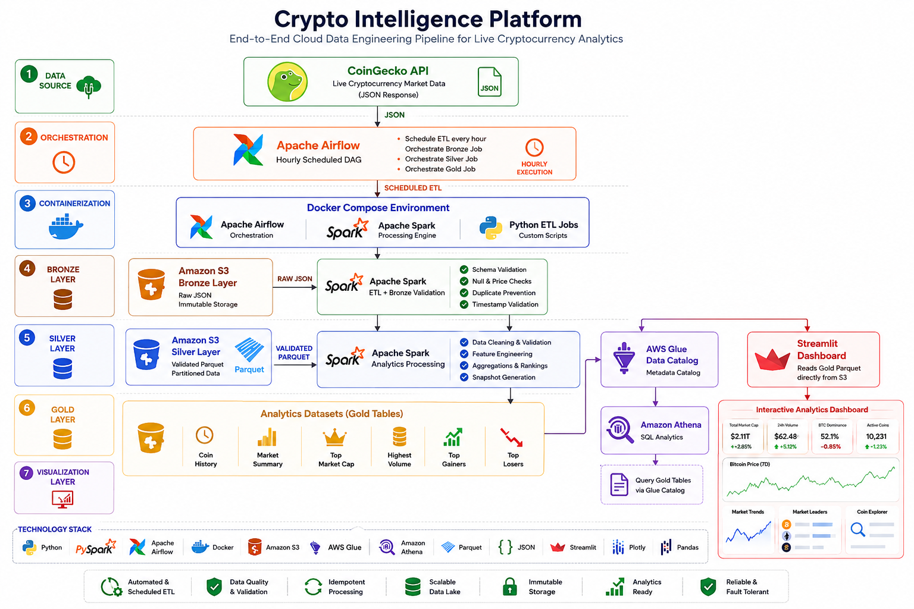
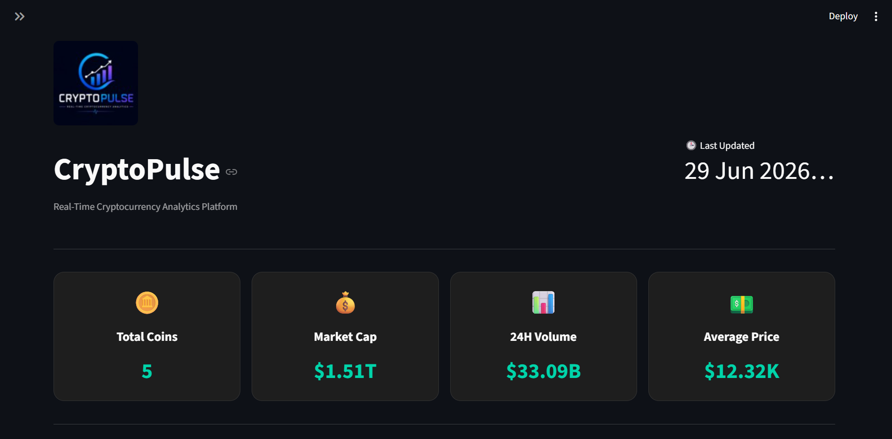
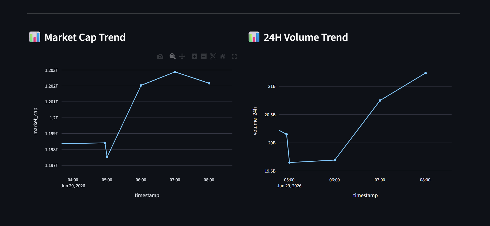
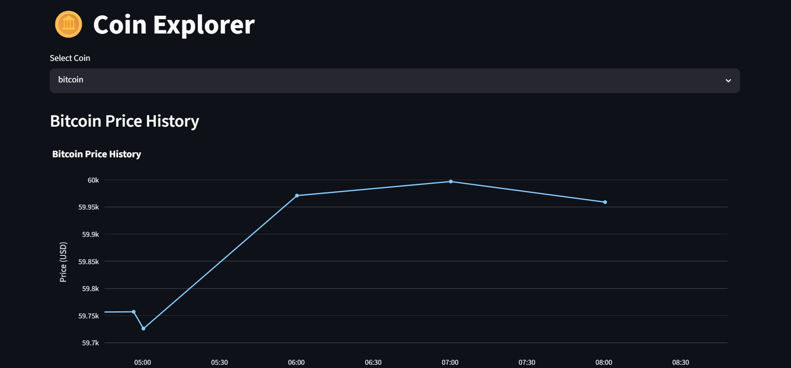
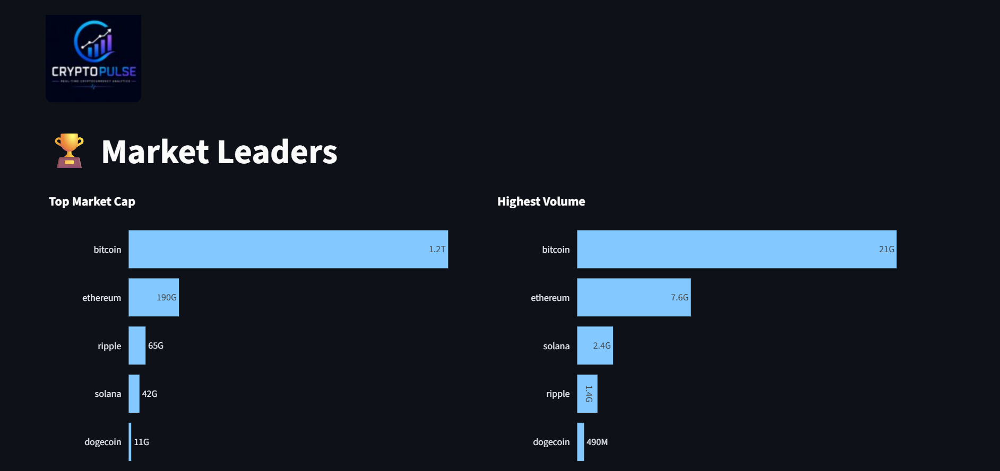
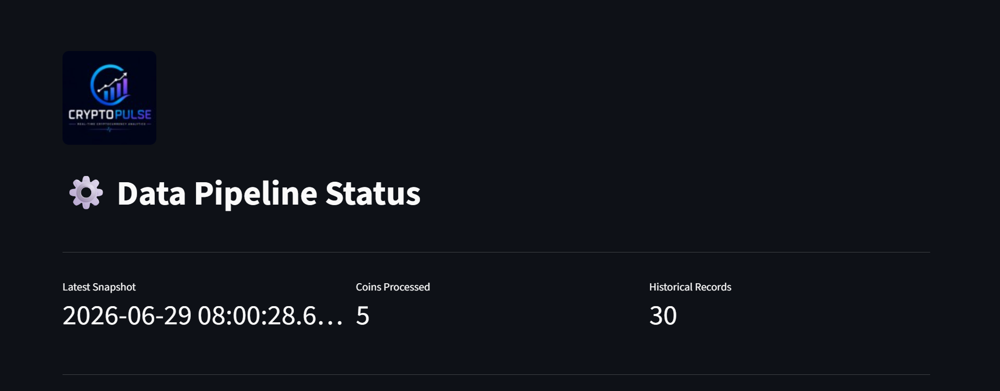

<p align="center">
  
</p>

<h1 align="center">CryptoPulse</h1>

<p align="center">
  <b>Cloud-Native Cryptocurrency Analytics Platform</b>
</p>

<p align="center">


</p>

---

# 🚀 Overview

CryptoPulse is a production-inspired cloud-native Data Engineering platform that automatically ingests hourly cryptocurrency market data, processes it through a Medallion (Bronze → Silver → Gold) architecture using Apache Spark, and delivers interactive analytics through a modern Streamlit dashboard.

The project demonstrates an end-to-end data engineering workflow including orchestration, distributed processing, cloud storage, metadata cataloging, SQL analytics, and business intelligence visualization.

---

# ✨ Key Features

* Automated hourly cryptocurrency data ingestion
* Apache Airflow workflow orchestration
* Distributed ETL using Apache Spark (PySpark)
* Bronze → Silver → Gold Medallion Architecture
* Amazon S3 Data Lake
* AWS Glue Data Catalog integration
* Amazon Athena SQL analytics
* Interactive multi-page Streamlit dashboard
* Historical cryptocurrency trend analysis
* Partitioned Parquet datasets
* Modular and production-inspired architecture

---

# 🛠️ Tech Stack

| Category               | Technologies            |
| ---------------------- | ----------------------- |
| Programming Language   | Python 3.11             |
| Workflow Orchestration | Apache Airflow          |
| Distributed Processing | Apache Spark (PySpark)  |
| Cloud Storage          | Amazon S3               |
| Data Lake Architecture | Bronze → Silver → Gold  |
| Metadata Catalog       | AWS Glue                |
| SQL Analytics          | Amazon Athena           |
| Dashboard              | Streamlit               |
| Visualization          | Plotly                  |
| File Format            | Apache Parquet          |
| Containerization       | Docker & Docker Compose |
| Version Control        | Git & GitHub            |

---

# 🏗️ System Architecture

The platform follows a modern Medallion Architecture to ingest, validate, transform, and analyze cryptocurrency market data.

<p align="center">

</p>

## Pipeline Flow

1. Apache Airflow triggers the pipeline every hour.
2. Cryptocurrency market data is collected from the CoinGecko API.
3. Raw JSON data is stored in the Bronze layer on Amazon S3.
4. Apache Spark validates and transforms the data into the Silver layer.
5. Business-ready datasets are written into the Gold layer as partitioned Parquet files.
6. AWS Glue catalogs the datasets.
7. Amazon Athena enables SQL-based analytics.
8. Streamlit reads the Gold layer and provides interactive dashboards.

---

# 📊 Dashboard Preview

CryptoPulse provides a multi-page analytics dashboard for exploring cryptocurrency market trends and pipeline health.

---

## 🏠 Executive Dashboard

### Header & KPI Overview

Displays the latest market summary including total tracked coins, total market capitalization, trading volume, average price and latest snapshot information.

<p align="center">

</p>

### Historical Market Analytics

Interactive charts for historical price movement, market capitalization trends and cryptocurrency analytics.

<p align="center">

</p>

---

## 🪙 Coin Explorer

Explore detailed information about individual cryptocurrencies including pricing, market capitalization, trading volume and circulating supply.

<p align="center">

</p>

---

## 🏆 Market Leaders

Analyze the highest market capitalization coins, highest trading volume, top gainers and top losers.

<p align="center">

</p>

---

## ⚙️ Pipeline Status

Monitor pipeline execution details, latest snapshot information and ingestion status.

<p align="center">

</p>

---

# 📂 Project Structure

```text
CryptoPulse/
│
├── airflow/                 # Airflow DAGs
├── dashboard/               # Streamlit Dashboard
├── images/                  # README Images
├── spark/                   # Spark ETL Jobs
├── src/
│   ├── extract/
│   ├── quality/
│   ├── transform/
│   └── utils/
├── docker-compose.yaml
├── requirements.txt
├── README.md
└── LICENSE
```

---

# ⚙️ Data Pipeline

```text
CoinGecko API
        │
        ▼
 Bronze Layer (Raw JSON)
        │
        ▼
 Silver Layer (Validated & Cleaned)
        │
        ▼
 Gold Layer (Analytics Ready Parquet)
        │
        ▼
 AWS Glue Catalog
        │
        ▼
 Amazon Athena
        │
        ▼
 Streamlit Dashboard
```

---

# 📈 Dashboard Modules

* 🏠 Executive Dashboard
* 🪙 Coin Explorer
* 📈 Market Trends
* 🏆 Market Leaders
* ⚙️ Pipeline Status
* ℹ️ About Project

---

# 🚀 Getting Started

```bash
git clone <repository-url>

cd crypto-intelligence-platform

docker compose up -d

streamlit run dashboard/app.py
```

---

# 🔮 Future Improvements

* Real-time streaming using Apache Kafka
* Managed Apache Airflow (Amazon MWAA)
* Kubernetes deployment
* CI/CD using GitHub Actions
* Automated anomaly detection
* Pipeline monitoring & alerting
* Multi-cloud deployment

---

# 📄 License

This project is licensed under the MIT License.

---

# 👨‍💻 Author

**Om Kapkoti**

B.Tech Mathematics & Data Science

Maulana Azad National Institute of Technology (MANIT), Bhopal

